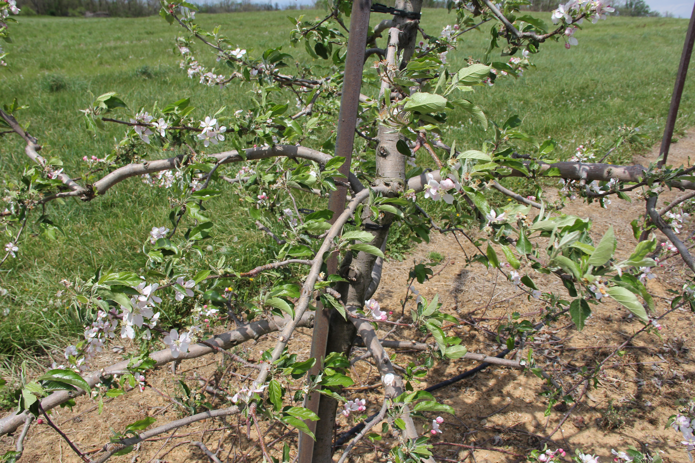

# Multi-species Fruit Flower Detection Dataset

[](https://creativecommons.org/licenses/by/4.0/)
[](https://github.com/your-repo/Multi-species-fruit-flower)
[](https://github.com/your-repo/Multi-species-fruit-flower)
[](https://github.com/your-repo/Multi-species-fruit-flower)
[](https://github.com/your-repo/Multi-species-fruit-flower)
[](https://github.com/your-repo/Multi-species-fruit-flower/issues)
[](https://github.com/your-repo/Multi-species-fruit-flower/pulls)
[](https://github.com/your-repo/Multi-species-fruit-flower/graphs/contributors)
[](https://github.com/your-repo/Multi-species-fruit-flower/commits)
[](https://doi.org/10.15482/USDA.ADC/1423466)

High-quality flower imagery for fruit flower detection and segmentation across multiple species (apples, peaches, pears). Suitable for flower detection, segmentation, and multi-species identification in orchard environments.

- **Project page**: `https://doi.org/10.15482/USDA.ADC/1423466`
- **Original paper**: `Multispecies_Fruit_Flower_Detection_Using_a_Refined_Semantic_Segmentation_Network.pdf`
- **Dataset repository**: `https://doi.org/10.15482/USDA.ADC/1423466`

## TL;DR

- **Task**: Object detection and segmentation
- **Modality**: RGB
- **Platform**: Ground
- **Real/Synthetic**: Real
- **Images**: 207 labeled images
- **Classes**: 3 fruit species
  - `apples`: 165 images (AppleA: 147, AppleB: 18)
  - `peaches`: 24 images
  - `pears`: 18 images
- **Resolution**: Variable (AppleA: 5184×3456; others: variable)
- **Annotations**: Per-image CSV and JSON (COCO-style); segmentation masks (PNG); COCO format available
- **Total annotations**: 3,411 bounding boxes
- **License**: CC BY 4.0 (see LICENSE)
- **Citation**: See below

## Table of Contents
- [Download](#download)
- [Dataset Structure](#dataset-structure)
- [Sample Images](#sample-images)
- [Annotation Schema](#annotation-schema)
- [Stats and Splits](#stats-and-splits)
- [Quick Start](#quick-start)
- [Evaluation and Baselines](#evaluation-and-baselines)
- [Datasheet (Data Card)](#datasheet-data-card)
- [Known Issues and Caveats](#known-issues-and-caveats)
- [License](#license)
- [Citation](#citation)
- [Changelog](#changelog)
- [Contact](#contact)

## Download

- **Original dataset**: `https://doi.org/10.15482/USDA.ADC/1423466`
- **This repository**: Hosts structure and conversion scripts only; place the downloaded folders under this directory.
- **Local license file**: See `LICENSE` (CC BY 4.0).

## Dataset Structure
```
Multi-species-fruit-flower/
├── apples/
│   ├── csv/                   # CSV per image
│   ├── json/                  # JSON per image
│   ├── images/                # JPG/BMP images (AppleA + AppleB combined)
│   ├── segmentations/         # PNG masks
│   ├── labelmap.json
│   └── sets/                  # train.txt / val.txt / test.txt (plus all.txt, train_val.txt)
├── peaches/
│   ├── csv/
│   ├── json/
│   ├── images/
│   ├── segmentations/         # PNG masks
│   ├── labelmap.json
│   └── sets/
├── pears/
│   ├── csv/
│   ├── json/
│   ├── images/
│   ├── segmentations/         # PNG masks
│   ├── labelmap.json
│   └── sets/
├── annotations/               # COCO JSON output (generated)
│   ├── apples_instances_train.json
│   ├── apples_instances_val.json
│   ├── apples_instances_test.json
│   ├── peaches_instances_train.json
│   ├── peaches_instances_val.json
│   ├── peaches_instances_test.json
│   ├── pears_instances_train.json
│   ├── pears_instances_val.json
│   └── pears_instances_test.json
├── scripts/
│   ├── convert_to_coco.py     # conversion utility
│   └── standardize.py         # standardization script
├── data/
│   └── original/              # Original data directories (preserved for backup)
│       ├── AppleA/            # Original AppleA images
│       ├── AppleB_1/          # Original AppleB images
│       ├── Peach_1/           # Original Peach images
│       ├── Pear_1/            # Original Pear images
│       ├── AppleA_Labels_1/   # AppleA segmentation masks
│       ├── AppleB_Labels_1/   # AppleB segmentation masks
│       ├── PeachLabels_1/    # Peach segmentation masks
│       ├── PearLabels_2/      # Pear segmentation masks
│       ├── train.txt          # Original train split list
│       ├── val_0.txt          # Original validation split list
│       ├── generate_coco_json.py  # Original annotation generation script
│       └── *.pdf              # Original paper/documentation
├── LICENSE
└── README.md
```
- Splits: `{category}/sets/train.txt`, `{category}/sets/val.txt`, `{category}/sets/test.txt` (and also `all.txt`, `train_val.txt`) list image basenames (no extension). If missing, all images are used.
- Note: AppleA and AppleB are combined into a single `apples/` category directory.
- Original data: All original data directories are preserved in `data/original/` for backup and reference purposes.

## Sample Images

Below are example images from this dataset. Paths are relative to this README location.

<table>
  <tr>
    <th>Category</th>
    <th>Sample</th>
  </tr>
  <tr>
    <td><strong>Apple Flower</strong></td>
    <td>
      
      <div align="center"><code>apples/images/IMG_0348.JPG</code></div>
    </td>
  </tr>
</table>

## Annotation Schema

- **CSV per-image schemas** (stored under `{category}/csv/` folder):
  - Columns include `item, x, y, width, height, label` (bounding boxes in absolute pixel coordinates).
  
- **JSON per-image schemas** (stored under `{category}/json/` folder):
  - Each image has a corresponding JSON file with COCO-style format
  - Bounding boxes: `[x, y, width, height]` in absolute pixel coordinates (top-left origin)
  
- **Segmentation masks** (stored under `{category}/segmentations/` folder):
  - PNG format binary masks where white pixels represent flower regions and black pixels represent background
  
- **COCO-style** (generated):
```json
{
  "info": {"year": 2018, "version": "1.0.0", "description": "Multi-species fruit flower apples train split", "url": "https://doi.org/10.15482/USDA.ADC/1423466"},
  "images": [{"id": 1, "file_name": "apples/images/IMG_0248.JPG", "width": 5184, "height": 3456}],
  "categories": [{"id": 1, "name": "apple", "supercategory": "apple"}],
  "annotations": [{"id": 1, "image_id": 1, "category_id": 1, "bbox": [x, y, w, h], "area": 1234, "iscrowd": 0}]
}
```

- **Label maps**: `{category}/labelmap.json` defines the category mapping.

## Stats and Splits
- Total images: 207
  - Apples: 165 images (AppleA: 147, AppleB: 18)
  - Peaches: 24 images
  - Pears: 18 images
- Images with annotations: 90 (apples: 48, peaches: 24, pears: 18)
- Total annotations: 3,411
- Training set: 128 images (1,397 annotations) across all categories
- Validation set: 34 images (1,635 annotations) across all categories
- Test set: 45 images (379 annotations) across all categories
- Splits provided via `{category}/sets/*.txt`. You may define your own splits by editing those files.

**Note**: 
- The dataset includes segmentation masks for images where available, making it suitable for both detection and segmentation tasks.
- Not all images have annotations; the original train/val splits are preserved, but some images may not have corresponding annotations.

## Quick Start

### Using COCO API

```python
from pycocotools.coco import COCO
import json

# Load COCO annotations
coco = COCO('annotations/apples_instances_train.json')

# Get all image IDs
img_ids = coco.getImgIds()

# Get annotations for first image
ann_ids = coco.getAnnIds(imgIds=img_ids[0])
anns = coco.loadAnns(ann_ids)

# Load image info
img_info = coco.loadImgs(img_ids[0])[0]
print(f"Image: {img_info['file_name']}")
print(f"Size: {img_info['width']}x{img_info['height']}")
```

### Converting to COCO format

If you need to regenerate COCO annotations from CSV files:

```bash
python scripts/convert_to_coco.py --root . --out annotations --splits train val test
```

### Dependencies

**Required**:
- `Pillow>=9.5` (for image processing)
- `opencv-python>=4.5.0` (for image processing)

**Optional**:
- `pycocotools>=2.0.7` (for COCO API)

Install with:
```bash
pip install -r requirements.txt
```

## Evaluation and Baselines

- **Primary metric**: mAP@[.50:.95] for detection; IoU for segmentation
- **Baseline results**: See citation paper for baseline results on flower detection and segmentation.

## Datasheet (Data Card)

### Motivation

This dataset was created to support research in multi-species fruit flower detection and segmentation in orchard environments, which is crucial for precision agriculture, yield estimation, and automated orchard management.

### Composition

The dataset consists of:
- **Image types**: RGB images of fruit flowers from apple, peach, and pear species
- **Categories**: 3 fruit species (apples, peaches, pears)
- **Annotation format**: Bounding boxes for object detection and segmentation masks (PNG) for segmentation tasks
- **Collection conditions**: Images collected under various conditions to support robust algorithm development

### Collection Process

- **Source**: Images collected in orchard environments
- **Annotation tool**: Ground truth masks created as binary images where white pixels represent flower regions and black pixels represent background
- **Validation**: Detection annotations (bounding boxes) were derived from the masks
- **Coordinate system**: Original bbox coordinates may use bottom-left origin (OpenCV style) and are converted to top-left origin (COCO style) during standardization

### Preprocessing

- Detection annotations are generated from segmentation masks
- Original bbox coordinates converted from bottom-left origin (OpenCV style) to top-left origin (COCO style) during standardization
- Images organized by fruit species

### Distribution

- Dataset is distributed under CC BY 4.0 license
- Original data hosted on Ag Data Commons
- This repository provides ancillary scripts and standardized structure

### Maintenance

- Dataset structure has been standardized according to the dataset structure specification
- COCO format annotations are generated from CSV files using the provided conversion script

## Known Issues and Caveats
- Image formats vary: AppleA uses JPG format, while AppleB, Peach, and Pear use BMP format.
- Image resolutions vary: AppleA images are high-resolution (5184×3456), while other categories may have different resolutions.
- Coordinate system: Original annotations may use bottom-left origin (OpenCV style); standardized annotations use top-left origin (COCO style).
- AppleA and AppleB: Both are combined into a single `apples/` category directory. File names are unique, so no conflicts occur.
- Segmentation masks: Not all images have corresponding masks; masks are available where provided in the original dataset.
- Coordinates are in pixel units with origin at the image top-left. Ensure downstream tooling expects absolute COCO boxes.
- Original data structure: Original data is preserved in source directories (AppleA/, AppleB_1/, Peach_1/, Pear_1/, etc.). The standardization script reads from these directories and generates the standardized structure in category directories.

## License

This dataset is licensed under the Creative Commons Attribution 4.0 International License (CC BY 4.0).

Check the original dataset terms and cite appropriately.

See `LICENSE` file for full license text.

## Citation
```bibtex
@dataset{dias2018multispecies,
  title={Data from: Multi-species fruit flower detection using a refined semantic segmentation network},
  author={Dias, Philipe A. and Tabb, Amy and Medeiros, Henry},
  year={2018},
  publisher={Ag Data Commons},
  doi={10.15482/USDA.ADC/1423466},
  url={https://doi.org/10.15482/USDA.ADC/1423466}
}
```

## Changelog

- **V1.0.0** (2025): Initial standardized structure and COCO conversion utility

## Contact

- **Maintainers**: Open to contributions via issue tracker
- **Original authors**: Philipe A. Dias, Amy Tabb, Henry Medeiros
- **Institution**: USDA ARS
- **Source**: `https://doi.org/10.15482/USDA.ADC/1423466`
- **Contact**: Amy Tabb (amy.tabb@ars.usda.gov)
